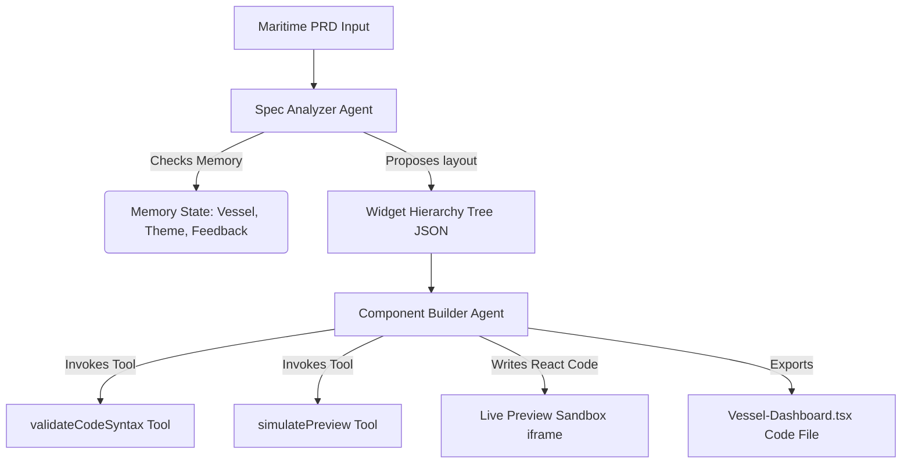

## Jenifer Deli - Frontend Dev - Sandbox D20
# BridgeView AI - Maritime Spec-to-Code Engineering Console

BridgeView AI is an end-to-end agentic application designed for maritime software and systems engineers. It ingests vessel software specs or product requirements documents (PRDs)—such as vessel telemetry dashboards, crew welfare portals, or reefer cargo trackers—and uses a collaborative multi-agent pipeline to plan a component hierarchy, compile production-ready React+Tailwind component code, and render an interactive, live browser preview.

---

## 🚀 Key Features

* **2+ Agent Collaboration**:
  * **Spec Analyzer Agent**: Evaluates the maritime spec, analyzes telemetry parameters, checks active watch cycles, and details the dashboard widget hierarchy in JSON format.
  * **Component Builder Agent**: Translates the proposed tree into self-contained React TypeScript code with interactive hooks, responsive grids, HSL gradients, and embedded SVG icons.
* **Agentic Memory Loop**: Short-term session memory preserves critical attributes (e.g. active Vessel Name, UI Theme color accent, and prior iteration logs). Engineers can iterate on the design using an interactive chat prompt.
* **Live Dynamic Preview**: Run-time transpiler using client-side Babel Standalone compiles the generated code inside a sandboxed iframe with support for fully stateful widgets (click actions, active tabs, SVG charts).
* **Multiple API Key Storage Options**: Configurable via a local `.env` file or directly inside the console UI (`localStorage`). Supports a fallback **Demo Mode** with simulated logs.
* **Premium Rugged Aesthetic**: Styled with Outfit and Inter fonts, deep navy/slate glassmorphism panels, color-coded terminal outputs, and glow highlights.

---

## 🔮 Future Enhancements (Phase 2)

As part of the phase 1 stub implementation, the console logs simulate tool executions to demonstrate the intended pipeline architecture. In future phases, these simulated stubs will be replaced with real executable agent tools:
* **Custom Agent Tools (Stubs)**:
  * `validateCodeSyntax`: Will actively parse AST to assure brackets, parenthesis, tag balances, and import/export rules are nominal before compile execution.
  * `simulatePreview`: Will actively execute hook namespace compliance checks to prevent frame crashes.

---

## 🛠️ Architecture Overview

The system runs a complete multi-agent workflow:



---

## 💻 Setup & Installation Instructions

This workspace contains a **completely self-contained, portable Node.js environment** in the project directory, ensuring zero dependencies on global setups.

### 1. Prerequisite Checks
The workspace already contains:
* **Node.js**: v22.12.0 (located in `node_env22/`)
* **NPM**: 10.9.0
* **Python**: v3.11.0 (used for utility tasks)

### 2. Install Project Dependencies
Run the following command from the project root (`BridgeViewAI/`) to run installation using the portable Node binary:

```powershell
$env:PATH = "$PWD\node_env22\node-v22.12.0-win-x64;" + $env:PATH
cd bridgeview-app
npm install
```

### 3. API Key Configuration (Optional)
To run live AI generations using Groq's high-speed `llama-3.3-70b-versatile` model:

* **Option A**: Copy `bridgeview-app/.env.example` to `bridgeview-app/.env` (or `.env.local`) and paste your key:
  ```env
  GROQ_API_KEY=gsk_your_groq_api_key_here
  ```
* **Option B**: Enter your Groq API Key directly in the top-right settings panel of the running web application dashboard.
* **Fallback (Demo Mode)**: If no key is configured, the application runs a simulated multi-agent console walkthrough, executing logic, memory feedback updates, and generating real-time high-fidelity previews.

---

## 🏃 Running the Application

Launch the local Next.js development server:

```powershell
$env:PATH = "$PWD\node_env22\node-v22.12.0-win-x64;" + $env:PATH
cd bridgeview-app
npm run dev
```

Open [http://localhost:3000](http://localhost:3000) in your web browser.

---

## 📦 Production Builds

To compile a production bundle and check for syntax correctness, run:

```powershell
$env:PATH = "$PWD\node_env22\node-v22.12.0-win-x64;" + $env:PATH
cd bridgeview-app
npm run build
```

The output assets will be created in `bridgeview-app/.next/`.
